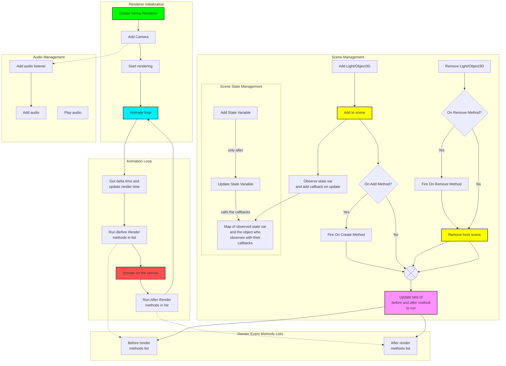

```mermaid
%%{init: {'flowchart': {'wrap': true, 'nodeSpacing': 50, 'rankSpacing': 50}}}%%
flowchart TD

  %% Renderer Initialization
  subgraph Renderer Initialization
    InitRenderer[Create Venus Renderer]
    AddCamera[Add Camera]
    StartRendering[Start rendering]
    AnimateLoop[Animate loop]
    InitRenderer --> AddCamera --> StartRendering --> AnimateLoop
  end

  %% Scene Management
  subgraph Scene Management
    %% Scene State Management
    subgraph Scene State Management
      AddStateVar[Add State Variable]
      UpdateStateVar[Update State Variable]
      UpdateStateVar[Update State Variable]
      StateObserverMap[Map of observed state var <br/>and the object who <br/> observes with their <br/>callbacks]
      AddStateVar -- only after --> UpdateStateVar
      UpdateStateVar -- calls the callbacks --> StateObserverMap
    end

    AddEntity[Add Light/Object3D]
    AddToScene[Add to scene]
    AddObservCallback[Observe state var <br/>and add callback on update]
    HasOnAddMethod{On Add Method?}
    TriggerOnAdd[Fire On Create Method]
    RemoveEntity[Remove Light/Object3D]
    RemoveFromScene[Remove from scene]
    HasOnRemoveMethod{On Remove Method?}
    TriggerOnRemove[Fire On Remove Method]
    UpdateEventMethods[Update lists of <br/><i>before</i> and <i>after</i> method<br/> to run]
    Summary@{ shape: cross-circ, label: "Summary" }

    AddEntity --> AddToScene --> HasOnAddMethod
    AddToScene --> AddObservCallback --> StateObserverMap
    HasOnAddMethod -- Yes --> TriggerOnAdd --> Summary
    HasOnAddMethod -- No --> Summary

    RemoveEntity --> HasOnRemoveMethod
    HasOnRemoveMethod -- Yes --> TriggerOnRemove --> RemoveFromScene --> Summary
    HasOnRemoveMethod -- No --> RemoveFromScene --> Summary

    Summary --> UpdateEventMethods
  end

  %% EventMethod Lists
  subgraph Render Event Methods Lists
    BeforeList[Before render <br/>methods list]
    AfterList[After render <br/>methods list]
  end

  %% Animation Loop
  subgraph Animation Loop
    ComputeDelta[Get delta time and <br/>update render time]
    RunBeforeEventMethods[Run <i>Before Render</i><br/> methods in list]
    RenderCanvas[Render on the canvas]
    RunAfterEventMethods[Run <i>After Render</i><br/> methods in list]

    AnimateLoop --> ComputeDelta --> RunBeforeEventMethods
    RunBeforeEventMethods --> RenderCanvas --> RunAfterEventMethods
    RunAfterEventMethods --> AnimateLoop
  end

  %% Audio Management
  subgraph Audio Management
    AddAudioListener[Add audio listener]
    AddAudio[Add audio]
    PlayAudio[Play audio]
    AddCamera -.-> AddAudioListener --> AddAudio
    PlayAudio
  end

  %% EventMethod Update
  RunBeforeEventMethods -.-> BeforeList
  RunAfterEventMethods -.-> AfterList
  UpdateEventMethods --> BeforeList
  UpdateEventMethods --> AfterList

  %% Styling
  style InitRenderer fill:#00ff00,stroke:#333,stroke-width:2px
  style AnimateLoop fill:#00eeff,stroke:#333,stroke-width:2px
  style RenderCanvas fill:#ff5050,stroke:#333,stroke-width:2px
  style UpdateEventMethods fill:#ff90ff,stroke:#333,stroke-width:2px
  style RemoveFromScene fill:#ffff00,stroke:#333,stroke-width:2px
  style AddToScene fill:#ffff00,stroke:#333,stroke-width:2px
```
